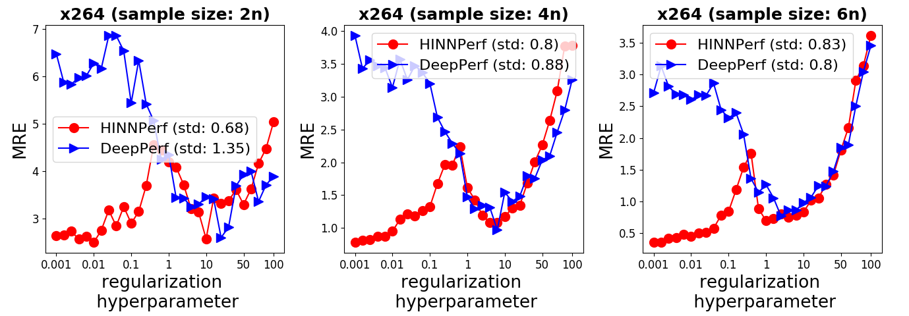
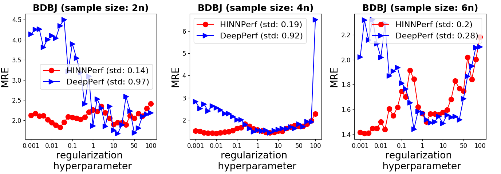
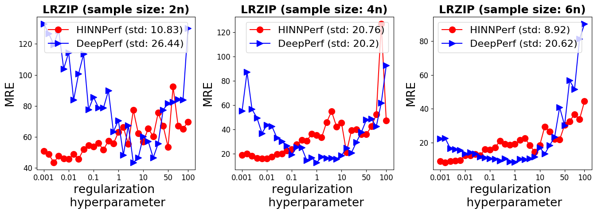
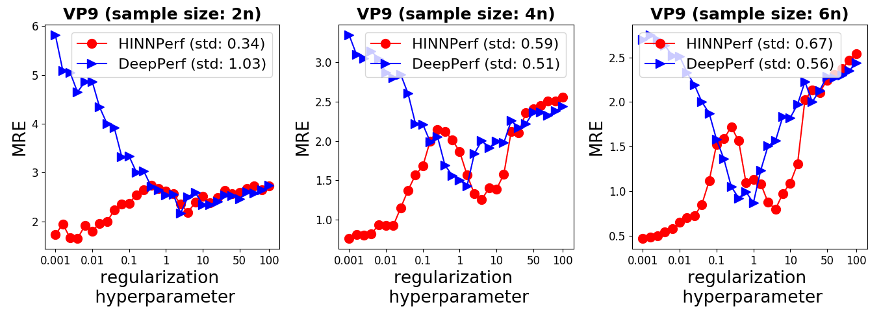
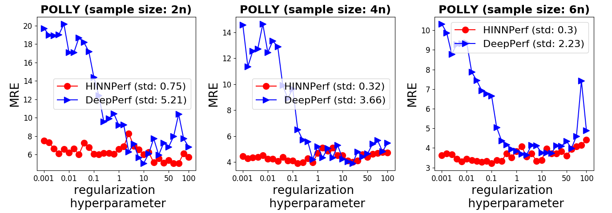
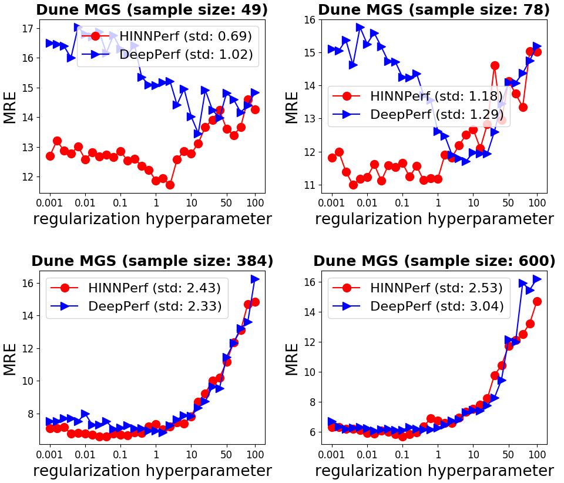
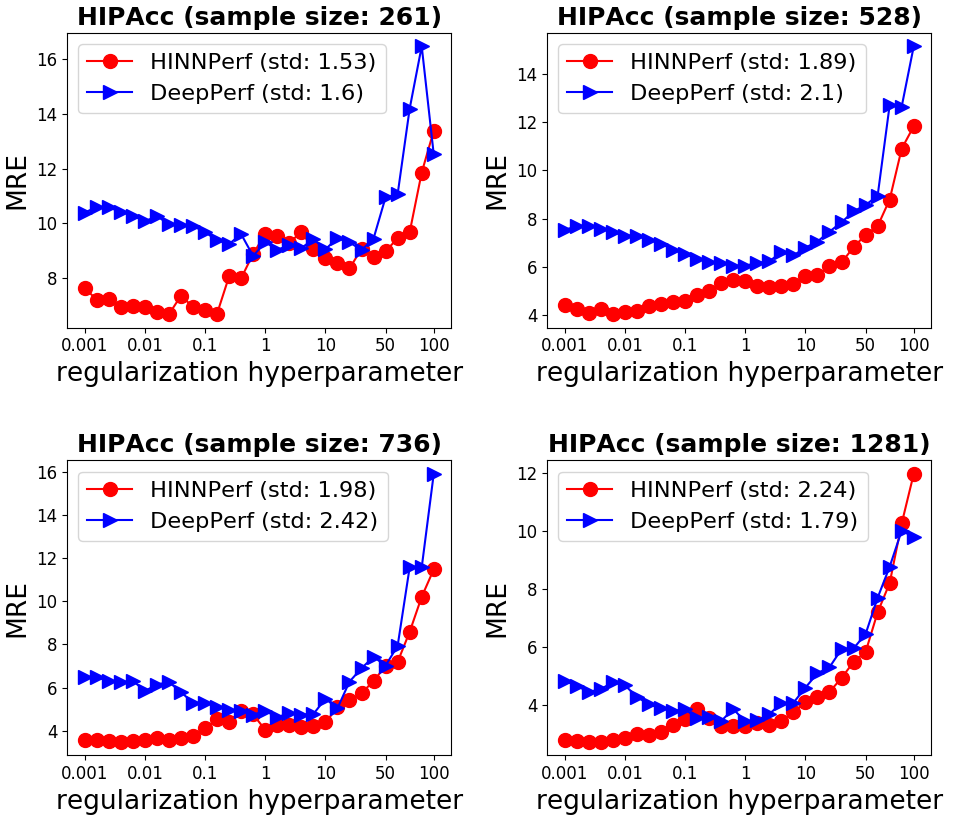
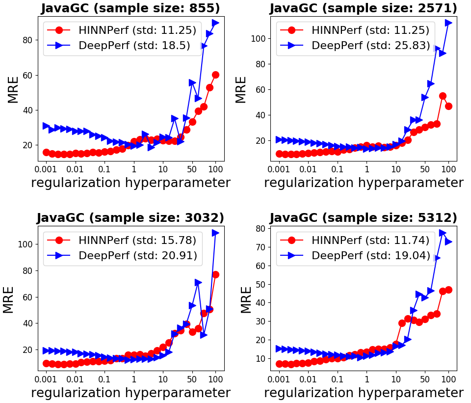
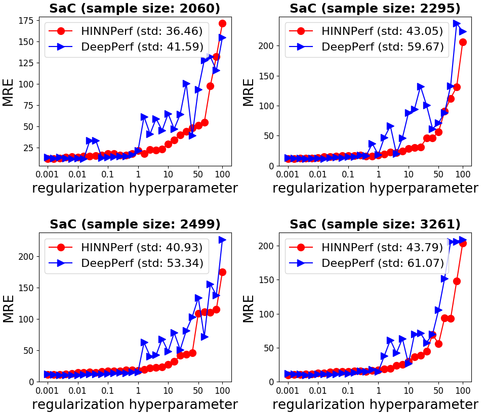

# HINNPerf_supplement
We provide supplementary material for HINNPerf method.

## Data

Data of subject systems is available in `data/` folder.

## Experimental Results

### Comparison between HINNPerf and other alternatives

<table>
    <thead>
        <tr>
            <th rowspan="2" >Subject System</th>
            <th rowspan="2" >Sample Size</th>
            <th colspan="2" >HINNPerf</th>
            <th colspan="2" >Sum-HINN</th>
            <th colspan="2" >MB-FNN</th>
            <th colspan="2" >L2-HINN</th>
            <th colspan="2" >Plain-HINN</th>
            <th colspan="2" >Dropout-HINN</th>
        </tr>
        <tr>
            <th scope="col">Mean</th>
            <th scope="col">Margin</th>
            <th scope="col">Mean</th>
            <th scope="col">Margin</th>
            <th scope="col">Mean</th>
            <th scope="col">Margin</th>
            <th scope="col">Mean</th>
            <th scope="col">Margin</th>
            <th scope="col">Mean</th>
            <th scope="col">Margin</th>
            <th scope="col">Mean</th>
            <th scope="col">Margin</th>
        </tr>
    </thead>
    <tbody>
        <tr>
            <td rowspan=3>x264</td>
            <td>2n</td>
            <td><b>3.00</b></td>
            <td>0.31</td>
            <td>3.02</td>
            <td>0.53</td>
            <td>3.09</td>
            <td>0.28</td>
            <td>4.55</td>
            <td>0.48</td>
            <td>9.09</td>
            <td>0.98</td>
            <td>7.61</td>
            <td>0.54</td>
        </tr>
        <tr>
            <td>4n</td>
            <td>0.98</td>
            <td>0.16</td>
            <td><b>0.83</b></td>
            <td>0.11</td>
            <td>1.07</td>
            <td>0.16</td>
            <td>1.90</td>
            <td>0.17</td>
            <td>4.49</td>
            <td>0.21</td>
            <td>4.47</td>
            <td>0.34</td>
        </tr>
        <tr>
            <td>6n</td>
            <td><b>0.42</b></td>
            <td>0.06</td>
            <td><b>0.42</b></td>
            <td>0.05</td>
            <td>0.54</td>
            <td>0.08</td>
            <td>1.02</td>
            <td>0.09</td>
            <td>3.18</td>
            <td>0.16</td>
            <td>3.42</td>
            <td>0.16</td>
        </tr>
        <tr>
            <td rowspan=3>BDB-J</td>
            <td>2n</td>
            <td>2.06</td>
            <td>0.15</td>
            <td><b>1.96</b></td>
            <td>0.18</td>
            <td>2.40</td>
            <td>0.30</td>
            <td>2.26</td>
            <td>0.23</td>
            <td>5.70</td>
            <td>0.84</td>
            <td>4.27</td>
            <td>0.48</td>
        </tr>
        <tr>
            <td>4n</td>
            <td><b>1.52</b></td>
            <td>0.06</td>
            <td>1.57</td>
            <td>0.07</td>
            <td><b>1.52</b></td>
            <td>0.08</td>
            <td>1.61</td>
            <td>0.09</td>
            <td>2.56</td>
            <td>0.25</td>
            <td>2.77</td>
            <td>0.15</td>
        </tr>
        <tr>
            <td>6n</td>
            <td>1.42</td>
            <td>0.14</td>
            <td>1.58</td>
            <td>0.17</td>
            <td><b>1.30</b></td>
            <td>0.16</td>
            <td>1.68</td>
            <td>0.18</td>
            <td>1.86</td>
            <td>0.21</td>
            <td>3.09</td>
            <td>0.25</td>
        </tr>
        <tr>
            <td rowspan=3>LRZIP</td>
            <td>2n</td>
            <td><b>48.44</b></td>
            <td>8.82</td>
            <td>50.38</td>
            <td>11.11</td>
            <td>58.21</td>
            <td>15.91</td>
            <td>83.85</td>
            <td>19.82</td>
            <td>82.97</td>
            <td>13.48</td>
            <td>77.08</td>
            <td>17.50</td>
        </tr>
        <tr>
            <td>4n</td>
            <td><b>16.53</b></td>
            <td>2.90</td>
            <td>17.37</td>
            <td>4.10</td>
            <td>22.01</td>
            <td>6.29</td>
            <td>26.31</td>
            <td>6.38</td>
            <td>47.95</td>
            <td>12.55</td>
            <td>42.10</td>
            <td>10.55</td>
        </tr>
        <tr>
            <td>6n</td>
            <td>10.05</td>
            <td>2.03</td>
            <td><b>8.34</b></td>
            <td>1.55</td>
            <td>12.07</td>
            <td>4.75</td>
            <td>10.32</td>
            <td>2.11</td>
            <td>28.03</td>
            <td>9.83</td>
            <td>18.95</td>
            <td>4.73</td>
        </tr>
        <tr>
            <td rowspan=3>VP9</td>
            <td>2n</td>
            <td>1.85</td>
            <td>0.15</td>
            <td><b>1.68</b></td>
            <td>0.16</td>
            <td>2.21</td>
            <td>0.24</td>
            <td>2.40</td>
            <td>0.15</td>
            <td>6.13</td>
            <td>0.47</td>
            <td>4.17</td>
            <td>0.23</td>
        </tr>
        <tr>
            <td>4n</td>
            <td><b>0.73</b></td>
            <td>0.08</td>
            <td>0.79</td>
            <td>0.08</td>
            <td>1.22</td>
            <td>0.10</td>
            <td>1.32</td>
            <td>0.06</td>
            <td>3.63</td>
            <td>0.12</td>
            <td>2.88</td>
            <td>0.12</td>
        </tr>
        <tr>
            <td>6n</td>
            <td><b>0.44</b></td>
            <td>0.02</td>
            <td>0.46</td>
            <td>0.06</td>
            <td>0.83</td>
            <td>0.08</td>
            <td>0.90</td>
            <td>0.06</td>
            <td>3.08</td>
            <td>0.11</td>
            <td>2.35</td>
            <td>0.07</td>
        </tr>
        <tr>
            <td rowspan=3>POLLY</td>
            <td>2n</td>
            <td>6.20</td>
            <td>0.89</td>
            <td><b>6.03</b></td>
            <td>1.06</td>
            <td>14.61</td>
            <td>3.13</td>
            <td>14.43</td>
            <td>1.49</td>
            <td>22.71</td>
            <td>2.32</td>
            <td>20.51</td>
            <td>1.73</td>
        </tr>
        <tr>
            <td>4n</td>
            <td><b>4.14</b></td>
            <td>0.48</td>
            <td>4.17</td>
            <td>0.44</td>
            <td>6.31</td>
            <td>1.66</td>
            <td>5.66</td>
            <td>0.66</td>
            <td>14.96</td>
            <td>2.07</td>
            <td>11.72</td>
            <td>1.40</td>
        </tr>
        <tr>
            <td>6n</td>
            <td>3.50</td>
            <td>0.22</td>
            <td><b>3.35</b></td>
            <td>0.22</td>
            <td>4.15</td>
            <td>0.38</td>
            <td>3.80</td>
            <td>0.27</td>
            <td>10.55</td>
            <td>0.78</td>
            <td>7.86</td>
            <td>1.16</td>
        </tr>
        <tr>
            <td rowspan=4>Dune MGS</td>
            <td>49</td>
            <td>13.43</td>
            <td>0.84</td>
            <td>13.05</td>
            <td>0.75</td>
            <td><b>12.86</b></td>
            <td>2.23</td>
            <td>13.09</td>
            <td>0.82</td>
            <td>13.72</td>
            <td>1.22</td>
            <td>13.28</td>
            <td>0.72</td>
        </tr>
        <tr>
            <td>78</td>
            <td>11.93</td>
            <td>0.67</td>
            <td><b>11.49</b></td>
            <td>0.58</td>
            <td>12.03</td>
            <td>0.97</td>
            <td>11.83</td>
            <td>0.63</td>
            <td>12.82</td>
            <td>1.09</td>
            <td>12.45</td>
            <td>0.53</td>
        </tr>
        <tr>
            <td>384</td>
            <td><b>6.74</b></td>
            <td>0.19</td>
            <td>6.77</td>
            <td>0.18</td>
            <td>7.19</td>
            <td>0.34</td>
            <td>6.83</td>
            <td>0.18</td>
            <td>7.18</td>
            <td>0.24</td>
            <td>7.56</td>
            <td>0.18</td>
        </tr>
        <tr>
            <td>600</td>
            <td><b>5.86</b></td>
            <td>0.13</td>
            <td>5.89</td>
            <td>0.23</td>
            <td>6.36</td>
            <td>0.39</td>
            <td>6.08</td>
            <td>0.16</td>
            <td>6.14</td>
            <td>0.18</td>
            <td>6.65</td>
            <td>0.10</td>
        </tr>
        <tr>
            <td rowspan=4>HIPA𝑐𝑐</td>
            <td>261</td>
            <td><b>7.24</b></td>
            <td>0.36</td>
            <td>7.31</td>
            <td>0.26</td>
            <td>7.28</td>
            <td>0.37</td>
            <td>7.53</td>
            <td>0.29</td>
            <td>10.32</td>
            <td>0.94</td>
            <td>9.19</td>
            <td>0.39</td>
        </tr>
        <tr>
            <td>528</td>
            <td><b>4.55</b></td>
            <td>0.20</td>
            <td>4.57</td>
            <td>0.13</td>
            <td>4.67</td>
            <td>0.31</td>
            <td>4.60</td>
            <td>0.19</td>
            <td>7.30</td>
            <td>0.19</td>
            <td>5.71</td>
            <td>0.27</td>
        </tr>
        <tr>
            <td>736</td>
            <td><b>3.59</b></td>
            <td>0.12</td>
            <td>3.61</td>
            <td>0.07</td>
            <td>3.63</td>
            <td>0.16</td>
            <td>3.66</td>
            <td>0.08</td>
            <td>6.04</td>
            <td>0.22</td>
            <td>4.49</td>
            <td>0.16</td>
        </tr>
        <tr>
            <td>1281</td>
            <td><b>2.81</b></td>
            <td>0.06</td>
            <td>2.82</td>
            <td>0.05</td>
            <td>2.86</td>
            <td>0.07</td>
            <td>2.82</td>
            <td>0.05</td>
            <td>4.07</td>
            <td>0.20</td>
            <td>3.15</td>
            <td>0.10</td>
        </tr>
        <tr>
            <td rowspan=4>HSMGP</td>
            <td>77</td>
            <td><b>5.63</b></td>
            <td>0.54</td>
            <td>6.09</td>
            <td>0.83</td>
            <td>6.28</td>
            <td>1.52</td>
            <td>6.58</td>
            <td>0.66</td>
            <td>7.05</td>
            <td>1.39</td>
            <td>7.15</td>
            <td>1.46</td>
        </tr>
        <tr>
            <td>173</td>
            <td><b>3.02</b></td>
            <td>0.12</td>
            <td>3.09</td>
            <td>0.16</td>
            <td>3.11</td>
            <td>0.40</td>
            <td>3.11</td>
            <td>0.23</td>
            <td>3.23</td>
            <td>0.15</td>
            <td>4.95</td>
            <td>1.86</td>
        </tr>
        <tr>
            <td>384</td>
            <td>2.03</td>
            <td>0.10</td>
            <td>1.92</td>
            <td>0.08</td>
            <td>2.33</td>
            <td>0.33</td>
            <td><b>1.84</b></td>
            <td>0.09</td>
            <td>1.87</td>
            <td>0.08</td>
            <td>2.29</td>
            <td>0.15</td>
        </tr>
        <tr>
            <td>480</td>
            <td>1.80</td>
            <td>0.06</td>
            <td>1.85</td>
            <td>0.12</td>
            <td>1.79</td>
            <td>0.10</td>
            <td>1.78</td>
            <td>0.13</td>
            <td><b>1.58</b></td>
            <td>0.10</td>
            <td>2.09</td>
            <td>0.14</td>
        </tr>
        <tr>
            <td rowspan=4>JavaGC</td>
            <td>855</td>
            <td><b>15.99</b></td>
            <td>1.17</td>
            <td>16.90</td>
            <td>1.22</td>
            <td>16.05</td>
            <td>0.95</td>
            <td>20.79</td>
            <td>1.40</td>
            <td>27.59</td>
            <td>1.02</td>
            <td>20.41</td>
            <td>0.55</td>
        </tr>
        <tr>
            <td>2571</td>
            <td><b>10.02</b></td>
            <td>0.44</td>
            <td>10.72</td>
            <td>0.41</td>
            <td>11.17</td>
            <td>0.65</td>
            <td>13.27</td>
            <td>0.57</td>
            <td>18.61</td>
            <td>0.37</td>
            <td>14.10</td>
            <td>0.33</td>
        </tr>
        <tr>
            <td>3032</td>
            <td><b>9.74</b></td>
            <td>0.54</td>
            <td>10.30</td>
            <td>0.58</td>
            <td>10.44</td>
            <td>0.79</td>
            <td>12.24</td>
            <td>0.50</td>
            <td>17.47</td>
            <td>0.39</td>
            <td>13.92</td>
            <td>0.64</td>
        </tr>
        <tr>
            <td>5312</td>
            <td><b>7.12</b></td>
            <td>0.24</td>
            <td>8.31</td>
            <td>0.26</td>
            <td>8.66</td>
            <td>0.25</td>
            <td>10.04</td>
            <td>0.38</td>
            <td>14.85</td>
            <td>0.18</td>
            <td>10.80</td>
            <td>0.24</td>
        </tr>
        <tr>
            <td rowspan=4>SaC</td>
            <td>2060</td>
            <td><b>13.50</b></td>
            <td>0.94</td>
            <td>13.52</td>
            <td>0.85</td>
            <td>15.59</td>
            <td>1.22</td>
            <td>14.34</td>
            <td>0.75</td>
            <td>22.49</td>
            <td>0.56</td>
            <td>15.20</td>
            <td>0.92</td>
        </tr>
        <tr>
            <td>2295</td>
            <td>14.05</td>
            <td>1.18</td>
            <td><b>13.22</b></td>
            <td>0.64</td>
            <td>14.12</td>
            <td>1.06</td>
            <td>14.51</td>
            <td>0.97</td>
            <td>21.92</td>
            <td>0.61</td>
            <td>13.86</td>
            <td>0.84</td>
        </tr>
        <tr>
            <td>2499</td>
            <td><b>12.37</b></td>
            <td>0.70</td>
            <td>12.78</td>
            <td>0.77</td>
            <td>14.10</td>
            <td>1.20</td>
            <td>13.01</td>
            <td>0.65</td>
            <td>20.57</td>
            <td>0.42</td>
            <td>12.91</td>
            <td>0.59</td>
        </tr>
        <tr>
            <td>3261</td>
            <td><b>11.48</b></td>
            <td>0.73</td>
            <td>11.85</td>
            <td>0.91</td>
            <td>14.13</td>
            <td>0.97</td>
            <td>12.54</td>
            <td>0.59</td>
            <td>18.95</td>
            <td>0.43</td>
            <td>11.68</td>
            <td>0.61</td>
        </tr>
    </tbody>
</table>

### Results of hyperparameter sensitivity tests

*Please click the link if you cannot see the picture*.

#### x264

#### BDB-J

#### LRZIP

#### VP9

#### POLLY

#### Dune MGS

#### HIPA𝑐𝑐

#### HSMGP

#### JavaGC

#### SaC

